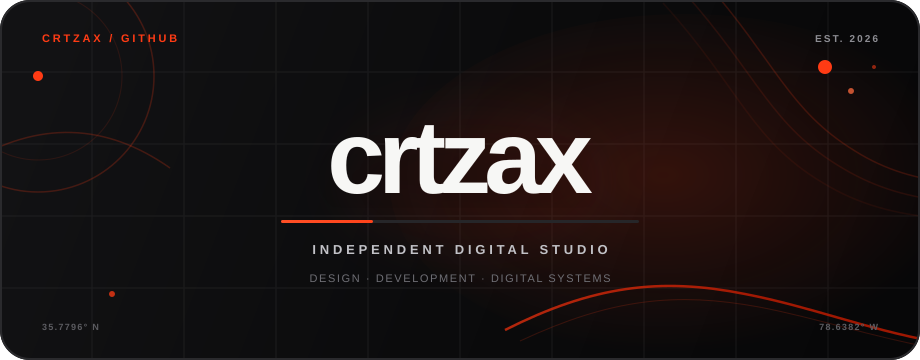

<div align="center">



<br><br>

[](https://crtzax.com)
[](https://app.crtzax.com)
[](#repositories)

**Independent digital studio · North Carolina / Worldwide**

*Digital work that refuses to blend in.*

</div>

---

## We build the part people remember

**crtzax** is an independent digital studio focused on building distinctive
digital experiences, brand systems, websites, applications, and the
infrastructure behind them.

This GitHub organization is the engineering home of the studio: public-facing
experiments, production websites, internal products, shared systems, and the
code that connects them.

The goal is simple — build things that feel intentional from the first pixel
to the last request.

---

## The crtzax ecosystem

| Product | Role | Access |
| --- | --- | --- |
| **[crtzax.com](https://crtzax.com)** | Studio website, portfolio, services, and public brand presence | Public |
| **[app.crtzax.com](https://app.crtzax.com)** | Secure operating system for clients, projects, files, approvals, billing, and studio operations | Private |

Each product is its own system, but they share the same design language,
engineering standards, and attention to detail.

---

## What we build

```text
Brand + digital direction
        │
        ├── Websites
        ├── Web applications
        ├── Client platforms
        ├── Commerce experiences
        ├── Internal tools
        ├── Design systems
        └── Digital infrastructure
```

crtzax projects are designed as complete products rather than disconnected
screens. Visual identity, interaction, performance, accessibility, backend
architecture, deployment, and long-term maintainability are treated as parts
of the same system.

---

## Engineering philosophy

### Design should have a point of view

Clean does not have to mean generic. crtzax uses typography, composition,
motion, contrast, and interaction deliberately so a product feels recognizable
without becoming difficult to use.

### The interface is only one layer

A polished frontend means little if the system behind it is fragile. Production
work is built with clear boundaries, secure server-side behavior, maintainable
data flows, and infrastructure that can be understood later.

### Motion should explain, not distract

Animation is used to establish hierarchy, reveal relationships, and create
character. Reduced-motion preferences and non-animated fallback states remain
first-class requirements.

### Documentation is part of the product

Important architectural decisions, conventions, handoff state, and
implementation details live with the code. The repository should explain
itself well enough for another developer — or another development session —
to continue without rebuilding context from scratch.

### Production should match the repository

Where practical, deployments are tied to clean, committed, pushed source so
the Git history remains an accurate record of what is running.

---

## Core stack

Technologies vary by project, but the current crtzax ecosystem is centered
around:

<div align="center">

[](https://astro.build)
[](https://react.dev)
[](https://www.typescriptlang.org)
[](https://tailwindcss.com)
[](https://cloudflare.com)

</div>

| Layer | Typical tooling |
| --- | --- |
| Frontend | Astro, React, TypeScript |
| Styling | Tailwind CSS + project-level design systems |
| Motion | GSAP and native browser interaction |
| Runtime | Cloudflare Workers / Pages |
| Database | Cloudflare D1 |
| Storage | Cloudflare R2 |
| State | Cloudflare KV where appropriate |
| Email | Resend |
| Testing | Vitest + project-specific integration coverage |
| Source | GitHub |

The stack is chosen around the product, not the other way around.

---

## Repositories

Repositories generally fall into a few categories:

| Type | Purpose |
| --- | --- |
| **Studio** | crtzax brand, website, portfolio, and public-facing systems |
| **Products** | Applications and platforms operated by crtzax |
| **Client work** | Repositories created for individual client engagements |
| **Infrastructure** | Shared deployment, tooling, automation, or operational code |
| **Experiments** | Concepts, prototypes, interaction studies, and R&D |

Public repositories are intentionally readable.

Private repositories may contain client information, internal implementation
details, security architecture, operational tooling, or proprietary product
work and must remain inside the organization unless explicitly approved.

---

## Repository standards

A production crtzax repository should make its purpose and operating model
clear without requiring tribal knowledge.

Common expectations include:

```text
README.md                project overview + operating instructions
AGENTS.md                instructions for coding agents
CLAUDE.md                project-specific development guidance
docs/                    durable technical + product documentation
docs/CURRENT_STATE.md    handoff state when the project uses phased development
.github/                 CI, issue templates, and repository automation
LICENSE                   explicit ownership / permitted-use terms
```

Not every repository needs every file. The rule is to document what another
developer would otherwise have to rediscover.

---

## Working across crtzax repositories

Before making a substantial change:

1. Read the repository `README.md`.
2. Read `AGENTS.md` and `CLAUDE.md` when present.
3. Check `docs/CURRENT_STATE.md` before assuming unfinished work is missing.
4. Read the domain-specific documentation related to the change.
5. Inspect nearby implementation before introducing a new pattern.
6. Reuse the project's existing design language, primitives, security model,
   and architecture.
7. Add or update tests when behavior changes.
8. Run the repository's verification command before deployment.
9. Update durable documentation when the source of truth has changed.

Sibling repositories may be used as references for brand and architectural
consistency, but should not become accidental runtime dependencies.

---

## Design language

crtzax is built around a recognizable visual system:

**Signal**  
`#FF3B14`

**Ground**  
`#0B0B0C`

**Contrast**  
White / near-white

The system favors oversized typography, controlled whitespace, strong
contrast, restrained but expressive motion, editorial composition, and
details that reveal themselves through interaction.

The visual language can evolve from project to project without losing the
studio's identity.

---

## Security

Security-sensitive repositories follow a few baseline rules:

- authorization belongs on the server, not in hidden interface states;
- secrets never belong in source, URLs, client bundles, screenshots, or logs;
- production credentials are separated from local development;
- access should default to the minimum authority required;
- private object storage stays private unless access is explicitly granted;
- sensitive actions should create meaningful audit evidence;
- deployment shortcuts must not bypass the repository's security model;
- client and internal data should remain isolated by design.

Repository-specific security documentation takes precedence over this
organization-level overview.

---

## Open source & licensing

A public repository is not automatically an open-source repository.

Each project defines its own license and reuse terms. Unless a repository
explicitly states otherwise, crtzax branding, identity, artwork, copy,
proprietary systems, and client work remain protected.

Check the `LICENSE` file in the repository before copying, redistributing,
publishing, or incorporating project assets into another product.

---

## Contact

Want to build something with crtzax?

<div align="center">

**[crtzax.com](https://crtzax.com)** · **[app.crtzax.com](https://app.crtzax.com)** · **[hello@crtzax.com](mailto:hello@crtzax.com)**

<sub>North Carolina / Worldwide</sub>

<br><br>

**We build the part people remember.**

</div>
